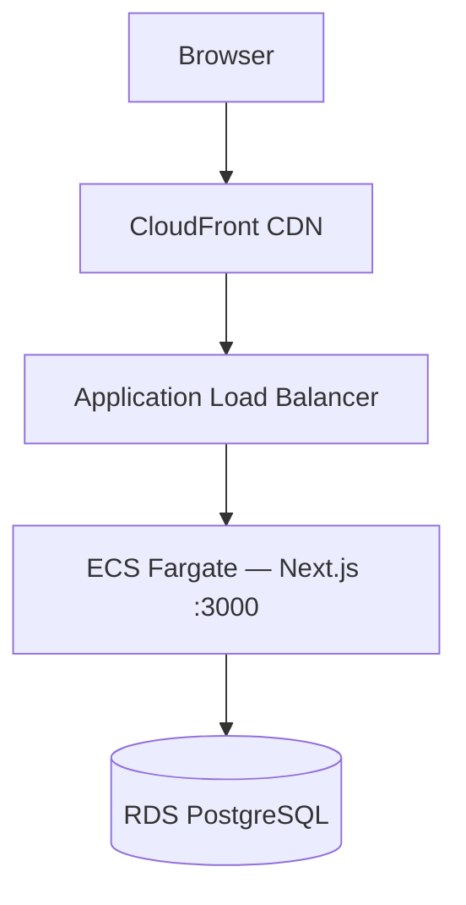

# AWS deployment (ap-southeast-2)

Deploy **FlatMate Finance** to **ECS Fargate + RDS PostgreSQL + CloudFront** in Sydney.

This project is a **single Next.js 15 application** (App Router). One Docker image runs the whole app: React UI, `/api/*` routes, and NextAuth. That matches how most teams deploy Next.js on ECS (standalone Node server) — not as separate “frontend” and “backend” containers.

## Architecture (Option A — one service)



| Layer | AWS service | Role |
|-------|-------------|------|
| CDN / HTTPS edge | CloudFront | Public URL, TLS, forwards cookies/headers for auth |
| Load balancer | ALB | Health checks on `/api/health`, routes all paths to one target group |
| Compute | ECS Fargate | Runs `node server.js` from Next.js **standalone** build |
| Database | RDS PostgreSQL | Private subnets; credentials in Secrets Manager |

**ECR:** one repository — `flatmate-finance`  
**ECS:** one service — `flatmate-finance-app`  
**Dockerfile:** repository root `Dockerfile` (Node **24.16.0**)

Locally, `docker compose` runs `db` + `migrate` + `app` (same image as production).

---

## Server-side vs client-side rendering (how this app runs in the cloud)

Understanding what runs **where** helps when debugging ECS, CloudFront, and env vars.

### What runs on the server (ECS / Node)

| Kind | Examples in this repo |
|------|------------------------|
| **Server Components** (default) | Dashboard layouts, flat pages that fetch data with `prisma`, server-only imports |
| **API Route Handlers** | `src/app/api/flats/*`, `src/app/api/auth/*`, `src/app/api/health/route.ts` |
| **Auth** | NextAuth (`src/auth.ts`) — session/JWT validation on the server |
| **Database** | Prisma + PostgreSQL adapter in `src/lib/prisma.ts` — **never** in the browser |

The Docker container is a **Node.js server** (`output: "standalone"`). For each request, Next.js may:

1. **SSR** — render React on the server and send HTML.
2. **Run Server Components** — execute React tree on the server, stream HTML/RSC payload.
3. **Handle `/api/*`** — return JSON without a full page.

All of that happens **inside ECS**. CloudFront and the ALB only proxy HTTP; they do not run your application code.

### What runs in the browser (client)

Files marked with `"use client"` are **Client Components**. They ship as JavaScript bundles and run after hydration:

- Forms (sign-in, create account, modals)
- `share-invite-button`, `copy-button`, sidebar interactions
- Anything using `useState`, `useEffect`, browser APIs (`navigator.share`, clipboard)

The browser calls your **same origin** (`https://<cloudfront-domain>/api/...`) for mutations; those requests hit ECS again.

### Build-time vs runtime env vars

| Variable | Where set | Visible to |
|----------|-----------|------------|
| `NEXT_PUBLIC_*` | Docker **build** (`--build-arg NEXT_PUBLIC_APP_URL`) and ECS task env | Browser + server (inlined at build for public vars) |
| `DATABASE_URL`, `AUTH_SECRET` | Secrets Manager → ECS task **runtime** | Server only |
| `AUTH_URL` | ECS task env (`AppUrl` / CloudFront URL) | Server (NextAuth redirects) |

If auth redirects break in production, `AUTH_URL` and `NEXT_PUBLIC_APP_URL` must match the **public CloudFront URL**.

### What CloudFront caches

The CloudFront stack sets **TTL 0** for `/` and `/api/*` so dynamic pages and APIs are not cached by default. Static assets under `/_next/static/*` are served by Next with long cache headers from the app.

### Why one container (not two)

Splitting “frontend” and “backend” on ECS is for **separate deployable services** (e.g. React SPA + Nest API). Next.js already colocates UI and API in one process. Running two copies of the same app on different ports would duplicate memory and break routing unless you split the codebase.

Industry practice for self-hosted Next.js: **one standalone container behind an ALB** ([Next.js deploying docs](https://nextjs.org/docs/app/getting-started/deploying), ECS guides 2025–2026).

---

## Prerequisites

- Docker Desktop
- [AWS CLI v2](https://docs.aws.amazon.com/cli/latest/userguide/getting-started-install.html)
- Permissions for VPC, ECS, RDS, IAM, ECR, CloudFormation, Secrets Manager, CloudFront
- GitHub repo for CI/CD (step 10)

```powershell
aws configure set region ap-southeast-2
aws sts get-caller-identity
```

---

## 1 — Dockerize

| File | Purpose |
|------|---------|
| `Dockerfile` | Production image — multi-stage, Node 24.16.0, standalone, port **3000** |
| `docker-compose.yml` | Local: Postgres + migrate + app |
| `src/app/api/health/route.ts` | ALB/ECS health check + DB connectivity |

`docker/backend/Dockerfile` and `docker/frontend/Dockerfile` are **deprecated** (legacy split layout).

## 2 — Test Docker locally

```powershell
docker compose up --build
```

```powershell
curl http://localhost:3000/api/health
# {"status":"ok","database":"connected"}

curl -I http://localhost:3000/
```

```powershell
docker compose down
```

---

## 3 — AWS secrets (Sydney)

```powershell
.\infrastructure\scripts\setup-secrets.ps1
```

| Secret | Contents |
|--------|----------|
| `flatmate-finance/db-password` | RDS master password |
| `flatmate-finance/auth-secret` | `AUTH_SECRET` (NextAuth + password-reset JWT) |
| `flatmate-finance/database-url` | Placeholder until RDS exists |

Use the **full Secrets Manager ARN** for RDS (not only the random suffix). `list-secret-arns.ps1` prints a copy-paste deploy command.

**AWS Free Tier** (this account): RDS template defaults are `db.t3.micro`, backup retention **1** day, PostgreSQL **16.9** (verify in region with `describe-db-engine-versions`). Using `db.t3.small`, 7-day backups, or `16.4` caused deploy failures.

If the RDS stack is `ROLLBACK_COMPLETE`, delete it before redeploying:

```powershell
aws cloudformation delete-stack --stack-name flatmate-finance-rds --region ap-southeast-2
```

After RDS is **CREATE_COMPLETE**:

```powershell
.\infrastructure\scripts\update-database-url-secret.ps1
```

---

## 4 — ECR: create repo and push image

**Create the repo before enabling GitHub Actions** (`AWS_ROLE_ARN`). Otherwise the workflow fails at push with `RepositoryNotFoundException`.

```powershell
.\infrastructure\scripts\create-ecr.ps1
```

Repo name: **`flatmate-finance`** (single repo).

```powershell
.\infrastructure\scripts\push-ecr.ps1 -AppUrl "https://YOUR_CLOUDFRONT_DOMAIN"
```

Or build manually:

```powershell
docker build -f Dockerfile --build-arg NEXT_PUBLIC_APP_URL=https://YOUR_URL -t flatmate-finance .
```

---

## 5–9 — CloudFormation (order matters)

| Step | File | Stack name (example) |
|------|------|------------------------|
| 5 | `01-vpc.yaml` | `flatmate-finance-vpc` |
| 5 | `02-security-groups.yaml` | `flatmate-finance-sg` |
| 6 | `06-iam.yaml` | `flatmate-finance-iam` |
| 7 | `05-rds.yaml` | `flatmate-finance-rds` (~10 min) |
| 8 | `07-ecs-cluster.yaml` | `flatmate-finance-ecs` |
| 8 | `08-alb.yaml` | `flatmate-finance-alb` |
| 9 | `09-ecs-app.yaml` | `flatmate-finance-ecs-app` |
| 9 | `11-cloudfront.yaml` | `flatmate-finance-cf` |

**IAM** — set your GitHub user/org:

```powershell
aws cloudformation deploy `
  --stack-name flatmate-finance-iam `
  --template-file infrastructure/cloudformation/06-iam.yaml `
  --capabilities CAPABILITY_NAMED_IAM `
  --parameter-overrides GitHubOrg=YOUR_GITHUB_USERNAME `
  --region ap-southeast-2
```

**RDS** — pass full `DbPasswordSecretArn` from `list-secret-arns.ps1`. See `docs/AWS_DEPLOY_COMMANDS.md` for Free Tier parameters and troubleshooting.

**First-time schema** (before or after ECS deploy):

```powershell
# One-off migrate using the compose migrate target against RDS (via bastion/VPN) or:
docker compose run --rm migrate
# For AWS: run `npx prisma db push` or `prisma migrate deploy` with DATABASE_URL pointing at RDS.
```

**ECS app service:**

```powershell
aws cloudformation deploy `
  --stack-name flatmate-finance-ecs-app `
  --template-file infrastructure/cloudformation/09-ecs-app.yaml `
  --parameter-overrides `
    ImageUri=ACCOUNT.dkr.ecr.ap-southeast-2.amazonaws.com/flatmate-finance:latest `
    DatabaseUrlSecretArn=arn:aws:secretsmanager:ap-southeast-2:ACCOUNT:secret:flatmate-finance/database-url-XXXX `
    AuthSecretArn=arn:aws:secretsmanager:ap-southeast-2:ACCOUNT:secret:flatmate-finance/auth-secret-XXXX `
    AppUrl=https://d1234.cloudfront.net `
  --region ap-southeast-2
```

---

## 10 — GitHub Actions CI/CD

**Secrets** (repository → Settings → Actions):

| Secret | Value |
|--------|--------|
| `AWS_ROLE_ARN` | `GitHubActionsRoleArn` from IAM stack |
| `APP_URL` | `https://<cloudfront-domain>` |
| `CLOUDFRONT_DISTRIBUTION_ID` | From CloudFront stack output |

Workflow: `.github/workflows/deploy.yml` — build root `Dockerfile`, push to ECR, redeploy **`flatmate-finance-app`**, invalidate CloudFront.

---

## 11 — Smoke test

```powershell
$cf = aws cloudformation describe-stacks `
  --stack-name flatmate-finance-cf `
  --region ap-southeast-2 `
  --query "Stacks[0].Outputs[?OutputKey=='CloudFrontDomainName'].OutputValue" `
  --output text

curl "https://$cf/api/health"
```

- CloudFront URL loads the app (SSR + client hydration)
- `/api/health` → `200`, `"database":"connected"`
- CloudWatch → `/ecs/flatmate-finance/app`
- ECS service **`flatmate-finance-app`** → RUNNING

---

## Troubleshooting

| Issue | Check |
|-------|--------|
| Health 503 | `database-url` secret, RDS security group, schema migrated |
| OIDC deploy fails | `GitHubOrg` / repo in `06-iam.yaml`, branch **`dev`** |
| GitHub “Build and push” fails | ECR repo missing — `.\infrastructure\scripts\create-ecr.ps1` |
| RDS deploy fails (Free Tier) | `db.t3.micro`, `BackupRetentionPeriod=1`, engine `16.9` in `05-rds.yaml` |
| RDS secret not found | Use full ARN for `DbPasswordSecretArn`, not suffix only |
| ECS cluster create fails (SLR) | `aws iam create-service-linked-role --aws-service-name ecs.amazonaws.com`; delete `flatmate-finance-ecs` if rolled back, redeploy |
| NextAuth redirect errors | `AUTH_URL` = public CloudFront URL |
| Local dev vs Docker | `yarn dev` may use SQLite; Docker/AWS use PostgreSQL |

## Related files

- **`docs/AWS_DEPLOY_COMMANDS.md`** — step-by-step checklist and current “do next” commands
- `infrastructure/scripts/*.ps1`
- `.env.example`
- `next.config.ts` — `output: "standalone"`
