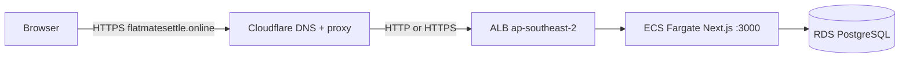

# Deploy on https://flatmatesettle.online (Cloudflare + ALB, no CloudFront)

You have **VPC, SG, IAM, RDS, secrets, ECS cluster, and ALB** already. This guide skips the CloudFront stack and publishes the app at **`https://flatmatesettle.online`** using **Cloudflare DNS** in front of your **ALB**.

**Resend** (e.g. `support.flatmatesettle.online` DNS in Cloudflare) is separate from app hosting — keep existing Resend/MX/TXT records; only add or change records for the **app hostname** below.

---

## Architecture



| Piece | Role |
|-------|------|
| **Cloudflare** | Public DNS, TLS to visitors, DDoS, optional caching |
| **ALB** | Routes traffic to ECS, health check `/api/health` |
| **ECS** | Runs Docker image from ECR |
| **RDS** | Postgres (private); URL in Secrets Manager |

**Skip:** `11-cloudfront.yaml` / stack `flatmate-finance-cf` (add later if you want a CDN).

---

## Progress (you are here)

| Done | Next |
|------|------|
| ECS cluster + ALB | TLS + DNS → ECR image → ECS app → DB schema → smoke test |

**Production URL everywhere:** `https://flatmatesettle.online` (no trailing slash).

---

## Step 1 — Get your ALB hostname

```powershell
$env:Path += ";C:\Program Files\Amazon\AWSCLIV2\"
cd C:\Users\dobig\Documents\GitHub\flatmatefinance

$alb = aws cloudformation describe-stacks `
  --stack-name flatmate-finance-alb `
  --region ap-southeast-2 `
  --query "Stacks[0].Outputs[?OutputKey=='LoadBalancerDnsName'].OutputValue" `
  --output text

Write-Host "ALB DNS: $alb"
```

Example: `flatmate-finance-alb-1733430950.ap-southeast-2.elb.amazonaws.com`

---

## Step 2 — TLS (pick one path)

### Option A — Recommended: ACM on ALB + Cloudflare **Full (strict)**

Visitors → HTTPS (Cloudflare) → HTTPS (ALB with ACM).

**2A. Request certificate (Sydney region)**

```powershell
aws acm request-certificate `
  --domain-name flatmatesettle.online `
  --subject-alternative-names www.flatmatesettle.online `
  --validation-method DNS `
  --region ap-southeast-2
```

Note the **CertificateArn** from the output.

**2B. DNS validation in Cloudflare**

```powershell
aws acm describe-certificate `
  --certificate-arn arn:aws:acm:ap-southeast-2:957411488700:certificate/PASTE_ID `
  --region ap-southeast-2 `
  --query "Certificate.DomainValidationOptions[*].{Name:ResourceRecord.Name,Value:ResourceRecord.Value,Status:ValidationStatus}" `
  --output table
```

In **Cloudflare → DNS** for `flatmatesettle.online`, add each **CNAME** validation record ACM shows (name + target). Use **DNS only** (grey cloud) for validation records if Cloudflare proxy breaks validation.

Wait until status is **ISSUED**:

```powershell
aws acm describe-certificate `
  --certificate-arn YOUR_CERT_ARN `
  --region ap-southeast-2 `
  --query "Certificate.Status" `
  --output text
```

**2C. Attach cert to ALB (update existing stack)**

```powershell
aws cloudformation deploy `
  --stack-name flatmate-finance-alb `
  --template-file infrastructure/cloudformation/08-alb.yaml `
  --parameter-overrides CertificateArn=YOUR_ACM_CERT_ARN `
  --region ap-southeast-2
```

**2D. Cloudflare SSL/TLS**

Cloudflare dashboard → **SSL/TLS** → Overview → **Full (strict)**.

---

### Option B — Quick test: Cloudflare **Flexible** (HTTP to ALB only)

No ACM yet. Cloudflare terminates HTTPS; origin is **HTTP port 80** on ALB (current listener).

- Cloudflare **SSL/TLS** → **Flexible**
- Do **not** pass `CertificateArn` on ALB deploy
- Use for a quick DNS test only; switch to Option A for production

---

## Step 3 — Cloudflare DNS (app traffic)

Cloudflare → **DNS** → **Records** for `flatmatesettle.online`.

| Type | Name | Target | Proxy |
|------|------|--------|-------|
| **CNAME** | `@` (apex) | `$alb` (ALB DNS from step 1) | Proxied (orange cloud) |
| **CNAME** | `www` | `$alb` or `flatmatesettle.online` | Proxied |

**Do not remove** Resend records (`support`, MX, TXT for DKIM/SPF, etc.) — they are unrelated to the app ALB.

**Important**

- Apex `@` → ALB: Cloudflare supports CNAME flattening on the root; if your UI only allows A records, use **www** as the primary hostname and add a **Redirect rule** apex → www.
- After DNS propagates, `https://flatmatesettle.online` should reach the ALB (502/503 is normal until ECS app is running).

---

## Step 4 — Google OAuth (before or right after go-live)

[Google Cloud Console](https://console.cloud.google.com/apis/credentials) → your OAuth client:

**Authorized redirect URIs** — add exactly:

```text
https://flatmatesettle.online/api/auth/callback/google
```

(Optional) `https://www.flatmatesettle.online/api/auth/callback/google` if you use www.

Keep `http://localhost:3000/api/auth/callback/google` for local dev.

---

## Step 5 — Build and push Docker image

Image must be built with the **public** URL (inlined `NEXT_PUBLIC_APP_URL`):

```powershell
.\infrastructure\scripts\push-ecr.ps1 -AppUrl "https://flatmatesettle.online"
```

Or GitHub Actions: set repository secret **`APP_URL`** = `https://flatmatesettle.online`, push to **`dev`**, re-run workflow.

**Do not set** `CLOUDFRONT_DISTRIBUTION_ID` — you are not using CloudFront; the workflow skips invalidation when that secret is absent.

---

## Step 6 — Deploy ECS app service

```powershell
.\infrastructure\scripts\list-secret-arns.ps1
```

Copy **full ARNs** (not suffixes only), then:

```powershell
aws cloudformation deploy `
  --stack-name flatmate-finance-ecs-app `
  --template-file infrastructure/cloudformation/09-ecs-app.yaml `
  --parameter-overrides `
    ImageUri=957411488700.dkr.ecr.ap-southeast-2.amazonaws.com/flatmate-finance:latest `
    DatabaseUrlSecretArn=arn:aws:secretsmanager:ap-southeast-2:957411488700:secret:flatmate-finance/database-url-cqoeTc `
    AuthSecretArn=arn:aws:secretsmanager:ap-southeast-2:957411488700:secret:flatmate-finance/auth-secret-NxkG9l `
    GoogleOAuthSecretArn=arn:aws:secretsmanager:ap-southeast-2:957411488700:secret:flatmate-finance/google-oauth-NIH9Kd `
    ResendSecretArn=arn:aws:secretsmanager:ap-southeast-2:957411488700:secret:flatmate-finance/resend-Z65Ahu `
    AppUrl=https://flatmatesettle.online `
  --region ap-southeast-2
```

Wait until the service is **RUNNING** (5–10 minutes first time):

```powershell
aws ecs describe-services `
  --cluster flatmate-finance-cluster `
  --services flatmate-finance-app `
  --region ap-southeast-2 `
  --query "services[0].{Status:status,Running:runningCount,Desired:desiredCount,Events:events[0:3]}" `
  --output json
```

If tasks fail, check logs:

```powershell
aws logs tail /ecs/flatmate-finance/app --region ap-southeast-2 --since 30m
```

---

## Step 7 — Database schema on RDS (one time)

ECS does not auto-run migrations.

**Keep `.env.local` as** `DATABASE_URL="file:./dev.db"` **for local `yarn dev`.**  
Running `yarn prisma db push` with that URL fails with **P1013** because `schema.prisma` uses `provider = "postgresql"` (not SQLite).

RDS is **private** — your PC cannot reach it. Run migrate inside AWS:

```powershell
.\infrastructure\scripts\prisma-db-push-rds.ps1
```

Requires Docker Desktop running (~5–10 min). Uses the `database-url` secret automatically.

Until schema exists, `/api/health` may return **503** (`database: disconnected`).

---

## Step 8 — GitHub Actions (ongoing deploys)

**Settings → Secrets → Actions:**

| Secret | Value |
|--------|--------|
| `AWS_ROLE_ARN` | Already set from IAM stack |
| `APP_URL` | `https://flatmatesettle.online` |
| `CLOUDFRONT_DISTRIBUTION_ID` | **Leave unset** (no CloudFront) |

Push to **`dev`** → workflow builds image with your URL and runs `ecs update-service`.

---

## Step 9 — Smoke tests

```powershell
# Direct to ALB (bypass Cloudflare) — should work when ECS is healthy
curl "http://$alb/api/health"

# Public site
curl "https://flatmatesettle.online/api/health"
```

Expect: `{"status":"ok","database":"connected"}`

Then in a browser:

1. `https://flatmatesettle.online` — home loads  
2. Sign in / Google OAuth  
3. Forgot password (Resend — uses `support.flatmatesettle.online` from secrets)

---

## Step 10 — Cloudflare tuning (optional)

| Setting | Suggestion |
|---------|------------|
| **SSL/TLS** | Full (strict) with ACM on ALB |
| **Always Use HTTPS** | On |
| **Caching** | Default is fine; app sets low TTL on dynamic routes |
| **WebSockets** | On (if you add realtime later) |

**Page Rules / Cache Rules:** do not aggressively cache `/api/*` or auth cookies.

---

## Adding CloudFront later (optional)

If you add CloudFront later:

1. Deploy `11-cloudfront.yaml` with a **custom ACM cert in us-east-1** (CloudFront requirement).
2. Point Cloudflare to CloudFront instead of ALB.
3. Set `CLOUDFRONT_DISTRIBUTION_ID` in GitHub.

Not required for `flatmatesettle.online` today.

---

## Troubleshooting

| Symptom | Check |
|---------|--------|
| 502/503 from Cloudflare | ECS service running? Target group healthy? `aws logs tail /ecs/flatmate-finance/app` |
| Health OK on ALB URL but not domain | DNS/proxy: CNAME → correct ALB? Orange cloud on? |
| OAuth redirect mismatch | Google URI exactly `https://flatmatesettle.online/api/auth/callback/google`; `AppUrl` and image build URL match |
| `too many redirects` | Cloudflare SSL Flexible + ALB HTTPS redirect loop → use Full (strict) + ACM, or Flexible + HTTP-only ALB |
| Email works locally, not in AWS | Resend secret + `EMAIL_FROM`; DNS for `support.flatmatesettle.online` in Resend dashboard |
| 525 SSL handshake failed | Cloudflare Full (strict) but no valid cert on ALB → complete Step 2 Option A |

---

## Command checklist (copy order)

```powershell
$env:Path += ";C:\Program Files\Amazon\AWSCLIV2\"
cd C:\Users\dobig\Documents\GitHub\flatmatefinance
$AppUrl = "https://flatmatesettle.online"

# 1 ALB DNS (already deployed)
# 2 ACM + update ALB with CertificateArn=...
# 3 Cloudflare DNS → ALB
# 4 Google OAuth redirect
.\infrastructure\scripts\push-ecr.ps1 -AppUrl $AppUrl
# 6 ecs-app deploy (ARNs from list-secret-arns.ps1)
# 7 yarn prisma db push (against RDS)
curl "$AppUrl/api/health"
```

---

## Related docs

- `docs/AWS_DEPLOY_COMMANDS.md` — full stack list (CloudFront path optional)
- `docs/DATABASE_AND_SECRETS.md` — secrets and RDS URL
- `.env.example` — local vs production URL comments
