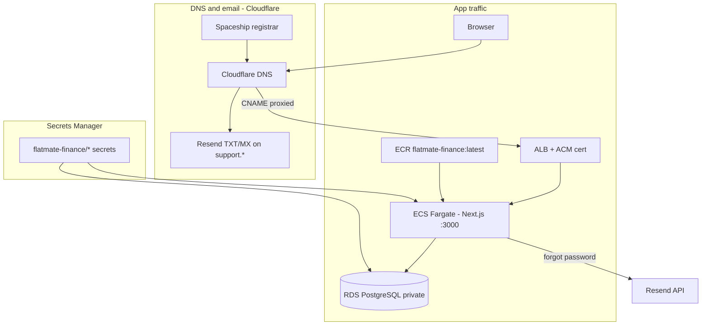

# Full AWS deployment guide — FlatMate Settle

End-to-end process for **flatmatesettle.online** on AWS (Sydney), with **Cloudflare** DNS, **Resend** email, and **no CloudFront** (ALB direct).

| Setting | Value |
|---------|--------|
| AWS account | `957411488700` |
| Region | `ap-southeast-2` (Sydney) |
| GitHub | `maazjavid/flatmatefinance`, branch **`dev`** |
| Production URL | `https://flatmatesettle.online` |
| Email from | `FlatMate Settle <no-reply@support.flatmatesettle.online>` |

---

## Architecture overview



| Layer | Service | Purpose |
|-------|---------|---------|
| DNS / edge TLS | Cloudflare | `flatmatesettle.online` → ALB |
| Compute | ECS Fargate | One container: UI + `/api/*` + NextAuth |
| Load balancer | ALB | HTTPS, health `/api/health` |
| Database | RDS PostgreSQL | Private; not reachable from your PC |
| Images | ECR | `flatmate-finance:latest` |
| Secrets | Secrets Manager | Passwords, OAuth, Resend, DB URL |
| Email | Resend | Transactional mail (separate DNS) |
| CI/CD | GitHub Actions | Build, push ECR, redeploy ECS |

**Skipped (optional later):** CloudFront stack `11-cloudfront.yaml`.

---

## Phase 0 — Prerequisites

### Tools

- [AWS CLI v2](https://docs.aws.amazon.com/cli/latest/userguide/getting-started-install.html)
- Docker Desktop (local build + push to ECR)
- PowerShell (scripts in `infrastructure/scripts/`)
- Git + GitHub access

### AWS CLI

```powershell
$env:Path += ";C:\Program Files\Amazon\AWSCLIV2\"
aws configure set region ap-southeast-2
aws sts get-caller-identity
```

### Local app test (optional)

```powershell
cd C:\Users\dobig\Documents\GitHub\flatmatefinance
docker compose up --build
curl.exe http://localhost:3000/api/health
```

---

## Phase 1 — Local secrets (`.env.local`)

Copy `.env.example` → `.env.local`. **Never commit** `.env.local`.

| Variable | Local value | Production |
|----------|-------------|------------|
| `DATABASE_URL` | `file:./dev.db` | AWS secret `database-url` (Postgres) |
| `AUTH_SECRET` | Your generated string | AWS secret `auth-secret` |
| `AUTH_URL` / `NEXT_PUBLIC_APP_URL` | `http://localhost:3000` | `https://flatmatesettle.online` |
| `GOOGLE_CLIENT_ID` / `GOOGLE_CLIENT_SECRET` | From Google Console | AWS secret `google-oauth` |
| `RESEND_API_KEY` | From Resend dashboard | AWS secret `resend` |
| `EMAIL_FROM` or `RESEND_FROM_EMAIL` | See Resend section below | Same in AWS `resend` secret |

**Important:** `yarn prisma db push` on your PC uses `prisma.config.ts` and **requires PostgreSQL URL** — it fails with `file:./dev.db` (P1013). That is expected. Use Docker migrate locally or `prisma-db-push-rds.ps1` for AWS.

---

## Phase 2 — Resend workflow (email)

Resend is **independent** of AWS app hosting. DNS lives in **Cloudflare** (often on subdomain `support`).

### 2.1 Resend account

1. Sign up at [resend.com](https://resend.com).
2. **API Keys** → Create → copy `re_...` into `.env.local`:
   ```env
   RESEND_API_KEY=re_xxxxxxxx
   ```

### 2.2 Domain for sending

**Production sender (your setup):**

```env
RESEND_FROM_EMAIL=FlatMate Settle <no-reply@support.flatmatesettle.online>
```

Or use `EMAIL_FROM=` (same value; app accepts either).

### 2.3 DNS in Cloudflare (Resend dashboard → Domains)

Add the domain or subdomain Resend gives you (e.g. `support.flatmatesettle.online`). Resend shows records to add:

| Typical records | Purpose |
|-----------------|--------|
| TXT `resend._domainkey...` | DKIM (DNS only / grey cloud) |
| MX (if required) | Mail routing |
| TXT SPF (if shown) | Sender policy |

**Proxy:** validation/DKIM records → **DNS only** (grey cloud).  
**Do not delete** these when adding app CNAMEs for `@` and `www`.

### 2.4 Verify in Resend

Wait until Resend shows domain **Verified**.

### 2.5 Upload to AWS

```powershell
.\infrastructure\scripts\setup-app-secrets-from-env.ps1
.\infrastructure\scripts\list-secret-arns.ps1
```

Confirm `flatmate-finance/resend` shows an ARN.

### 2.6 Test forgot-password

- Local: `yarn dev` with same `RESEND_*` in `.env.local`.
- Production: `https://flatmatesettle.online/forgot-password` after ECS is live.

---

## Phase 3 — Domain workflow (Spaceship + Cloudflare + AWS)

### 3.1 Registrar (Spaceship)

Point nameservers to Cloudflare (only Cloudflare NS, e.g. `xxx.ns.cloudflare.com`). No A/CNAME for the website at Spaceship.

### 3.2 ACM certificate (AWS, Sydney)

```powershell
aws acm request-certificate `
  --domain-name flatmatesettle.online `
  --subject-alternative-names www.flatmatesettle.online `
  --validation-method DNS `
  --region ap-southeast-2
```

Note the **CertificateArn**.

Get validation CNAMEs:

```powershell
$env:AWS_PAGER = ""
aws acm describe-certificate `
  --certificate-arn arn:aws:acm:ap-southeast-2:957411488700:certificate/YOUR_ID `
  --region ap-southeast-2 `
  --query "Certificate.DomainValidationOptions[*].{Domain:DomainName,Name:ResourceRecord.Name,Value:ResourceRecord.Value}" `
  --output table
```

### 3.3 Cloudflare — ACM validation (grey cloud)

For **each** validation row, add **CNAME**:

| Field | Value |
|-------|--------|
| Type | CNAME |
| Name | Host part only (e.g. `_585da6672c6c09e88fdf5f80f7f8b9d8`) |
| Target | Value from ACM (e.g. `...acm-validations.aws`) |
| Proxy | **DNS only** (grey) |

Wait until ACM status is **ISSUED**.

### 3.4 Cloudflare — app traffic (orange cloud)

Get ALB DNS:

```powershell
aws cloudformation describe-stacks `
  --stack-name flatmate-finance-alb `
  --region ap-southeast-2 `
  --query "Stacks[0].Outputs[?OutputKey=='LoadBalancerDnsName'].OutputValue" `
  --output text
```

Add records:

| Type | Name | Target | Proxy |
|------|------|--------|-------|
| CNAME | `@` | `flatmate-finance-alb-....elb.amazonaws.com` | **Proxied** |
| CNAME | `www` | same ALB | **Proxied** |

**Keep** all Resend TXT/MX records unchanged.

### 3.5 Cloudflare SSL

- **SSL/TLS** → **Full (strict)**
- **Always Use HTTPS** → On

### 3.6 Attach cert to ALB

```powershell
aws cloudformation deploy `
  --stack-name flatmate-finance-alb `
  --template-file infrastructure/cloudformation/08-alb.yaml `
  --parameter-overrides CertificateArn=arn:aws:acm:ap-southeast-2:957411488700:certificate/YOUR_ID `
  --region ap-southeast-2
```

---

## Phase 4 — Google OAuth

[Google Cloud Console](https://console.cloud.google.com/apis/credentials) → OAuth client:

**Authorized redirect URIs:**

```text
http://localhost:3000/api/auth/callback/google
https://flatmatesettle.online/api/auth/callback/google
https://www.flatmatesettle.online/api/auth/callback/google
```

Upload credentials to AWS:

```powershell
.\infrastructure\scripts\setup-app-secrets-from-env.ps1
```

---

## Phase 5 — AWS infrastructure (CloudFormation order)

Run from repo root. Each step depends on the previous.

### 5.1 VPC

```powershell
aws cloudformation deploy `
  --stack-name flatmate-finance-vpc `
  --template-file infrastructure/cloudformation/01-vpc.yaml `
  --region ap-southeast-2
```

### 5.2 Security groups

```powershell
aws cloudformation deploy `
  --stack-name flatmate-finance-sg `
  --template-file infrastructure/cloudformation/02-security-groups.yaml `
  --region ap-southeast-2
```

### 5.3 Core secrets (generated in AWS)

```powershell
.\infrastructure\scripts\setup-secrets.ps1
.\infrastructure\scripts\list-secret-arns.ps1
```

Creates: `db-password`, `auth-secret`, placeholder `database-url`.

### 5.4 IAM (GitHub OIDC + ECS roles)

```powershell
aws cloudformation deploy `
  --stack-name flatmate-finance-iam `
  --template-file infrastructure/cloudformation/06-iam.yaml `
  --capabilities CAPABILITY_NAMED_IAM `
  --parameter-overrides GitHubOrg=maazjavid GitHubRepo=flatmatefinance `
  --region ap-southeast-2
```

GitHub → repo → **Settings → Secrets → Actions**:

| Secret | Value |
|--------|--------|
| `AWS_ROLE_ARN` | Output `GitHubActionsRoleArn` from IAM stack |
| `APP_URL` | `https://flatmatesettle.online` |
| `CLOUDFRONT_DISTRIBUTION_ID` | Leave unset (no CloudFront) |

### 5.5 RDS (Free Tier–friendly defaults)

Use **full ARN** for db-password (from `list-secret-arns.ps1`):

```powershell
aws cloudformation deploy `
  --stack-name flatmate-finance-rds `
  --template-file infrastructure/cloudformation/05-rds.yaml `
  --parameter-overrides `
    DbPasswordSecretArn=arn:aws:secretsmanager:ap-southeast-2:957411488700:secret:flatmate-finance/db-password-XXXX `
    BackupRetentionPeriod=1 `
    DbInstanceClass=db.t3.micro `
    EngineVersion=16.9 `
  --region ap-southeast-2
```

If stack is `ROLLBACK_COMPLETE`, delete it first, then redeploy.

After **CREATE_COMPLETE**:

```powershell
.\infrastructure\scripts\update-database-url-secret.ps1
```

### 5.6 ECS cluster

```powershell
# One-time if first ECS deploy in account failed:
aws iam create-service-linked-role --aws-service-name ecs.amazonaws.com

aws cloudformation deploy `
  --stack-name flatmate-finance-ecs `
  --template-file infrastructure/cloudformation/07-ecs-cluster.yaml `
  --region ap-southeast-2
```

### 5.7 ALB

```powershell
aws cloudformation deploy `
  --stack-name flatmate-finance-alb `
  --template-file infrastructure/cloudformation/08-alb.yaml `
  --region ap-southeast-2
```

Later, redeploy with `CertificateArn=...` after ACM is issued (step 3.6).

### 5.8 ECR repository

```powershell
.\infrastructure\scripts\create-ecr.ps1
```

Required **before** GitHub Actions can push images.

---

## Phase 6 — App image and ECS service

### 6.1 App secrets in AWS

```powershell
.\infrastructure\scripts\setup-app-secrets-from-env.ps1
.\infrastructure\scripts\list-secret-arns.ps1
```

Need ARNs for: `database-url`, `auth-secret`, `google-oauth`, `resend`.

### 6.2 Build and push image

Docker Desktop must be running.

```powershell
.\infrastructure\scripts\push-ecr.ps1 -AppUrl "https://flatmatesettle.online"
```

Or: push to `dev` with GitHub Actions (`AWS_ROLE_ARN` + `APP_URL` set).

### 6.3 Deploy ECS app service

```powershell
aws cloudformation deploy `
  --stack-name flatmate-finance-ecs-app `
  --template-file infrastructure/cloudformation/09-ecs-app.yaml `
  --parameter-overrides `
    ImageUri=957411488700.dkr.ecr.ap-southeast-2.amazonaws.com/flatmate-finance:latest `
    DatabaseUrlSecretArn=arn:aws:secretsmanager:ap-southeast-2:957411488700:secret:flatmate-finance/database-url-XXXX `
    AuthSecretArn=arn:aws:secretsmanager:ap-southeast-2:957411488700:secret:flatmate-finance/auth-secret-XXXX `
    GoogleOAuthSecretArn=arn:aws:secretsmanager:ap-southeast-2:957411488700:secret:flatmate-finance/google-oauth-XXXX `
    ResendSecretArn=arn:aws:secretsmanager:ap-southeast-2:957411488700:secret:flatmate-finance/resend-XXXX `
    AppUrl=https://flatmatesettle.online `
  --region ap-southeast-2
```

### 6.4 RDS schema (one time, inside VPC)

**Do not** use `yarn prisma db push` with `file:./dev.db`.

```powershell
.\infrastructure\scripts\prisma-db-push-rds.ps1
```

Uses Fargate one-off task + `database-url` secret.

### 6.5 Redeploy after code changes

```powershell
.\infrastructure\scripts\push-ecr.ps1 -AppUrl "https://flatmatesettle.online"
aws ecs update-service `
  --cluster flatmate-finance-cluster `
  --service flatmate-finance-app `
  --force-new-deployment `
  --region ap-southeast-2
```

---

## Phase 7 — Verification

```powershell
curl.exe -sS "https://flatmatesettle.online/api/health"
# {"status":"ok","database":"connected"}

curl.exe -sS -I "https://flatmatesettle.online/"
```

Browser checks:

1. Home page loads  
2. Sign in / Google OAuth  
3. Forgot password (Resend)  
4. Create flat / join flow  

AWS Console:

- **ECS** → `flatmate-finance-app` → **RUNNING**  
- **Target group** → targets **healthy**  
- **CloudWatch** → `/ecs/flatmate-finance/app`

---

## Phase 8 — Ongoing deploys (GitHub Actions)

Workflow: `.github/workflows/deploy.yml` on push to **`dev`**.

1. Builds root `Dockerfile` with `APP_URL` secret  
2. Pushes to ECR `flatmate-finance`  
3. Forces ECS redeploy  
4. Skips CloudFront invalidation if `CLOUDFRONT_DISTRIBUTION_ID` unset  

---

## Troubleshooting reference

| Symptom | Cause | Fix |
|---------|--------|-----|
| `P1013` on `yarn prisma db push` | `file:./dev.db` + Postgres schema | Use `prisma-db-push-rds.ps1` or Docker migrate |
| `CannotPullContainerError :latest not found` | Empty ECR | `push-ecr.ps1` or GitHub Actions |
| `no encryption` in ECS logs | RDS requires TLS | RDS CA bundle + `prisma.ts` SSL (in repo) |
| `database: disconnected` | TLS or missing schema | `prisma-db-push-rds.ps1` + redeploy image |
| ACM validation stuck | Wrong CNAME or orange proxy on validation | Grey cloud for `_xxx` validation records |
| OAuth redirect error | URI mismatch | Exact production URL in Google Console + `AppUrl` |
| Resend send fails | Domain not verified or wrong secret | Resend dashboard + `setup-app-secrets-from-env.ps1` |
| RDS deploy Free Tier error | Instance class / backup / engine | `db.t3.micro`, retention `1`, engine `16.9` |
| ECS cluster SLR error | Missing service-linked role | `create-service-linked-role` for `ecs.amazonaws.com` |

---

## Script reference

| Script | Purpose |
|--------|---------|
| `setup-secrets.ps1` | Create db-password, auth-secret, placeholder database-url |
| `setup-app-secrets-from-env.ps1` | Upload Google + Resend from `.env.local` |
| `list-secret-arns.ps1` | Print ARNs for CloudFormation |
| `update-database-url-secret.ps1` | Point database-url at RDS endpoint |
| `create-ecr.ps1` | Create ECR repo |
| `push-ecr.ps1` | Build + push `latest` with `NEXT_PUBLIC_APP_URL` |
| `prisma-db-push-rds.ps1` | One-off Fargate migrate against RDS |

---

## Related docs

- [`DEPLOY_FLATMATESETTLE_ONLINE.md`](DEPLOY_FLATMATESETTLE_ONLINE.md) — domain + ALB focus  
- [`AWS_DEPLOY_COMMANDS.md`](AWS_DEPLOY_COMMANDS.md) — command checklist  
- [`DATABASE_AND_SECRETS.md`](DATABASE_AND_SECRETS.md) — secrets model  
- [`DEV_SETUP.md`](DEV_SETUP.md) — local dev + Resend basics  
